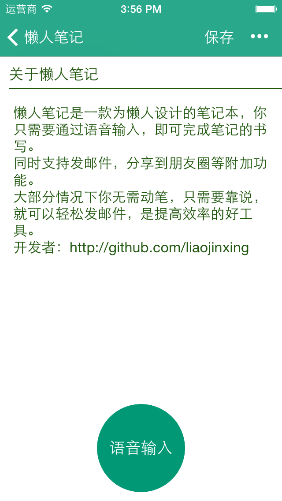
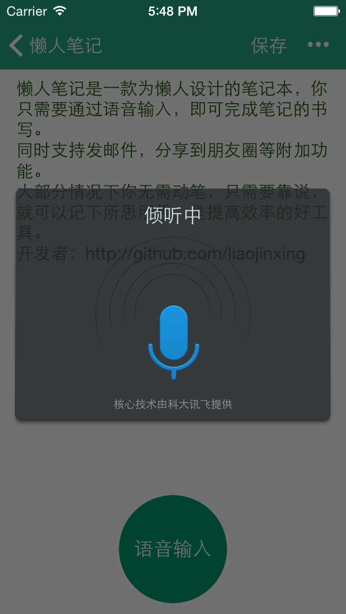

懒人笔记
=========
iTunes地址： https://itunes.apple.com/cn/app/lan-ren-bi-ji-zhi-chi-yu-yin/id899937013?mt=8 

- 懒人笔记是一款为懒人设计的笔记本，你只需要通过语音输入，即可完成笔记的书写。
- 同时支持发邮件，分享到朋友圈等附加功能。
- 大部分情况下你无需动笔，只需要靠说，就可以轻松记笔记、发邮件，是提高效率的好工具。

TODO
-----
- 当前只支持语音识别，接下来会尝试加入图片输入，通过拍照就可以把身边看到的东西转化为文字（但看起来开源的OCR，效果都不太理想）
- 尝试加入将录音文件转化为文字功能
