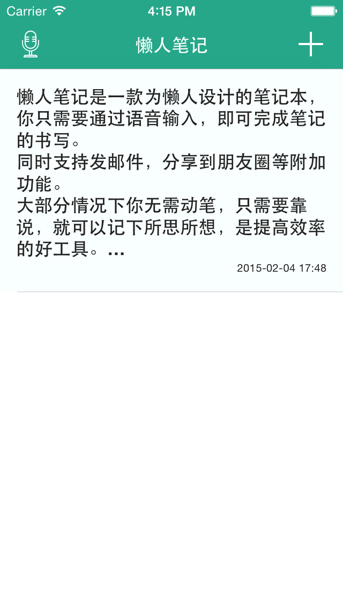
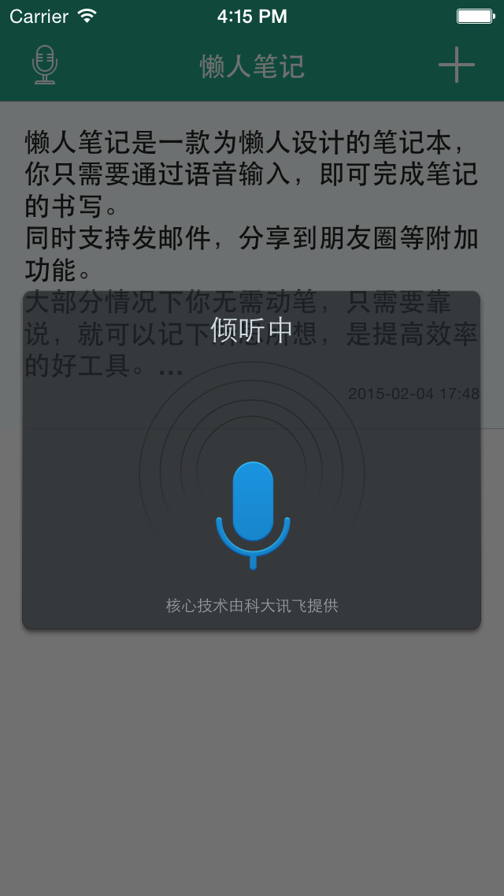
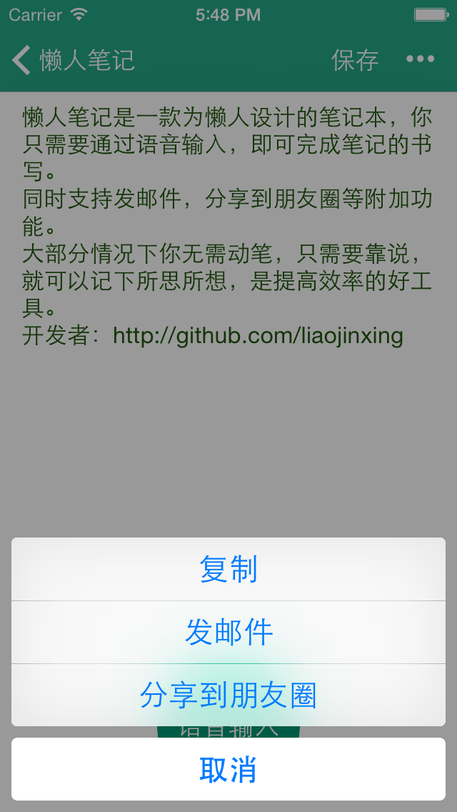

懒人笔记
=========
iTunes地址： https://itunes.apple.com/cn/app/lan-ren-bi-ji-zhi-chi-yu-yin/id899937013?mt=8 

- 懒人笔记是一款为懒人设计的笔记本，你只需要通过语音输入，即可完成笔记的书写。
- 同时支持发邮件，分享到朋友圈等附加功能。
- 大部分情况下你无需动笔，只需要靠说，就可以轻松记笔记、发邮件，是提高效率的好工具。

Installation
-----------
依赖于 CocoaPods，执行以下命令，下载相关依赖：

    /:> pod install

Other useful library
-------------
个人其他开源项目:

- 支持任意类型的URL router:[LJURLRouter]

- 自动轮播banner:[LJAutoScrollView]

- Swift实现的v2ex客户端:[V2EXClient]

- Swift语法分享PPT:[SwiftSharing]

- iOS \& web混合开发框架:[HybridBridge]

- 五星打分组件:[StarRatingView]

- 正则定义样式的UILabel:[RichStyleLabel]

- 常用图片处理category:[EasyImage]

- iOS AutoLayout科普及demo:[AutoLayout]

[LJAutoScrollView]:https://github.com/liaojinxing/LJAutoScrollView
[V2EXClient]:https://github.com/liaojinxing/V2EXClient
[SwiftSharing]:https://github.com/liaojinxing/SwiftSharing
[StarRatingView]:https://github.com/liaojinxing/StarRatingView
[HybridBridge]:https://github.com/liaojinxing/HybridBridge
[RichStyleLabel]:https://github.com/liaojinxing/RichStyleLabel
[EasyImage]:https://github.com/liaojinxing/EasyImage
[AutoLayout]:https://github.com/liaojinxing/Autolayout
[LJURLRouter]:https://github.com/liaojinxing/LJURLRouter
[Voice2Note]:https://github.com/liaojinxing/Voice2Note
